# Provision Oracle Cloud Instances

## Introduction
In this lab you are going to provision the Oracle Cloud instances needed to run a Micronaut application with Autonomous Database.

Estimated Lab Time: 10 minutes

### Objectives

In this lab you will:

* Download a Terraform script to setup an Oracle Cloud VM and Autonomous Database instance
* Create and Apply a Oracle Cloud Stack via Terraform
* Obtain the necessary configuration to run a Micronaut application locally and communicate with Autonomous Database

### Prerequisites
- An Oracle Cloud account, Free Trial, LiveLabs or a Paid account
- A generated SSH key pair (see Lab 1)

## **STEP 1**: Create a new Stack

1. Create Infrastructure by downloading the Terraform configuration: A [stack.zip](https://objectstorage.us-phoenix-1.oraclecloud.com/n/toddrsharp/b/micronaut-lab-assets/o/stack.zip) file.

2. In the Oracle Cloud Console go to the "Solutions and Platforms" -> "Resource Manager" -> "Stacks".

   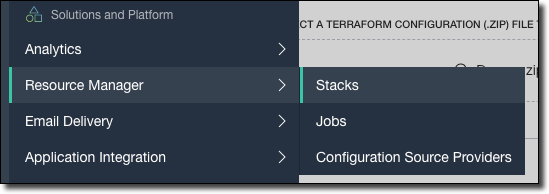

3. Click 'Create Stack' to create a new stack:

   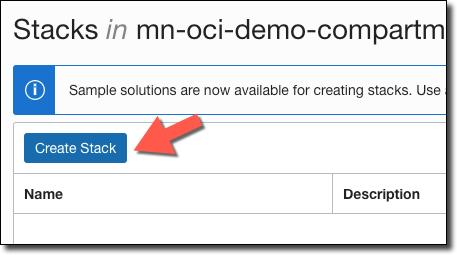

4. Select **My Configuration**, choose the **.ZIP FILE** button, click the **Browse** link and select the terraform configuration zip file. Click **Select**.

	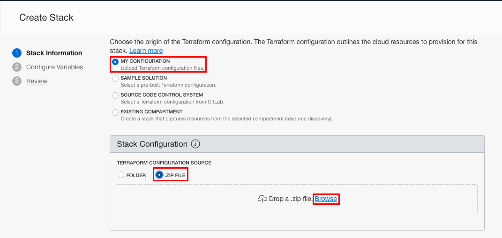

5. You can optionally enter a name and description of the stack then then choose the compartment for the Stack, then click 'Next':

   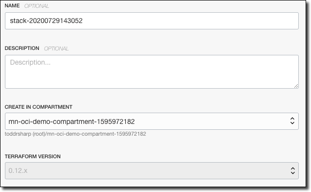

6. Under "Required Configuration" add the SSH key that you created in Lab 1. You can do so by dragging and dropping the public key file (the file that ends with `.pub`) or by choosing `PASTE SSH KEYS` then copying and pasting the contents of the public key file.

    Tip: On Unix systems you can output the contents of the public key file to be copied using the following command:

    ```
    cat ~/.ssh/id_rsa.pub
    ```

   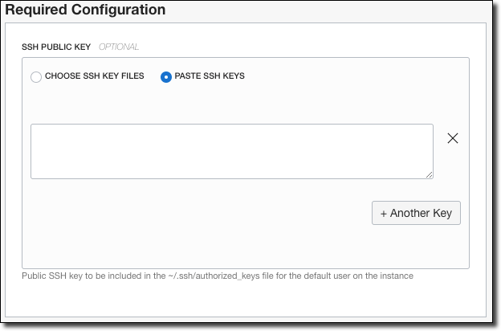

7. Under "Optional Configuration" make sure that "INSTANCE SHAPE" is set to "VM.Standard.E2.1.Micro":

   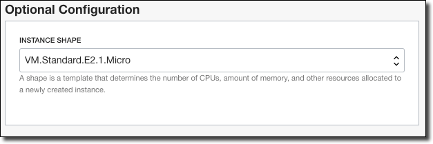

8. Finally review and create your stack.

   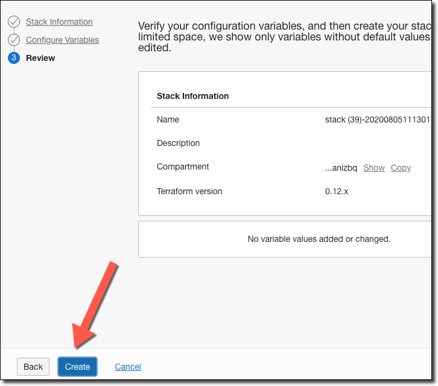

##  **STEP 2**: Apply the Terraform Plan

1. On the Stack Details page, click 'Terraform Actions' and select 'Plan'.

   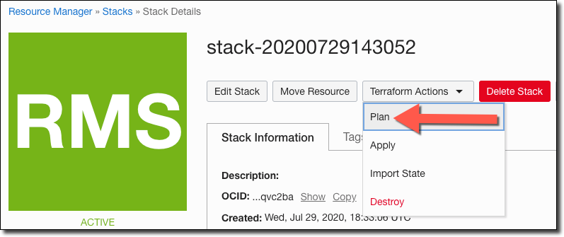

2. Review the plan output and ensure no failures occurred.

   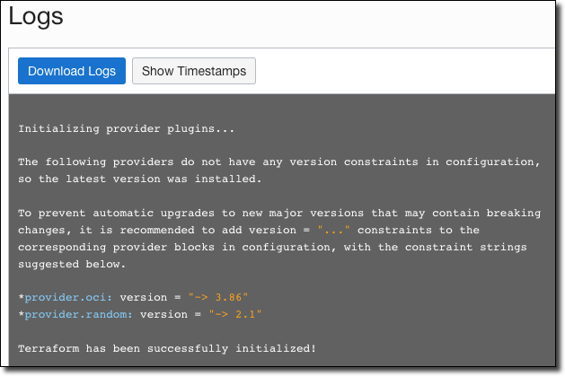

3. On the Stack Details page, Click 'Terraform Actions' and select 'Apply'.

   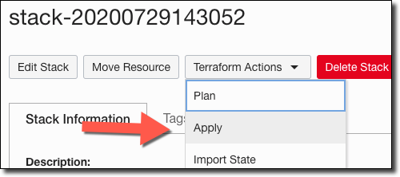

4. Choose the plan you just created, then click 'Apply'.

   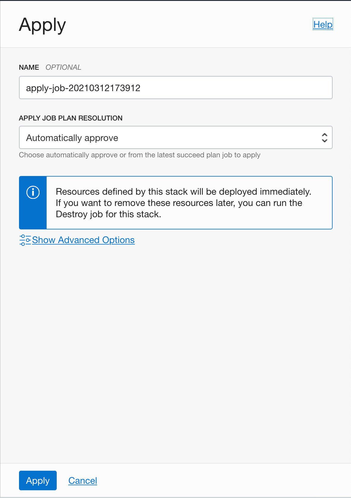


##  **STEP 3**: Capture Application Configuration Variables

1. Monitor the logs and ensure the Stack plan has been successfully applied then review the plan output variables by clicking "Outputs" on the left hand side of the Job Details panel:

   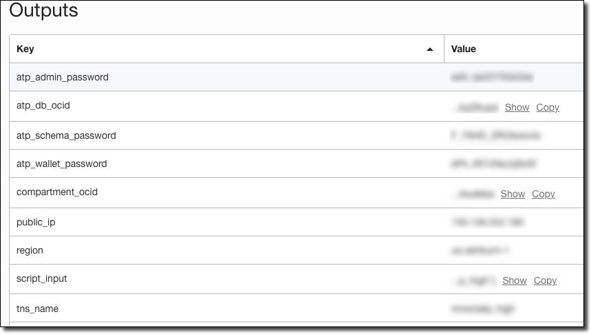

2. The Terraform stack produces the following values which are available in the 'Outputs' tab:

      * `atp_admin_password` - This is the administrative password of the Autonomous Database Instance
      * `atp_db_ocid` - This is the unique OCID of the Autonomous Database Instance
      * `atp_schema_password` - This is the schema password of the Autonomous Database Instance
      * `atp_wallet_password` - This is the wallet password of the Autonomous Database Instance
      * `compartment_ocid` - This is the compartment OCID used to identify the compartment where the database is setup
      * `public_ip` - This is the public IP address from the Oracle Cloud Infrastructure address pool
      * `region` - This is the region where the instance is running
      * `script_input` - A JSON string containing all of the values needed to create the DB schema in the next lab.
      * `tns_name` - This is the TNS name of the Autonomous Database instance

      You will need the value of `script_input` in the next step to configure your database. If you need any of the individual values in future steps, you can retrieve them later by going to the Oracle Cloud Console and going to "Resource Manager" -> "Stacks" then click the name of your Stack then under "Jobs" select the "apply-" job that ran and under "Resources" on the left you can navigate to "Outputs" where you will find the variables again.

      

      Click the name of your Stack under "Jobs"
      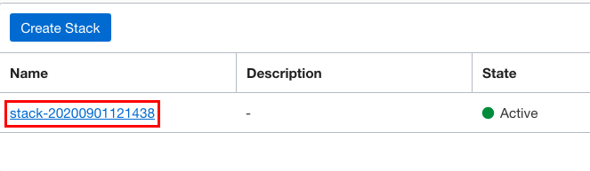

      Under "Jobs" select the "apply-" job that ran
      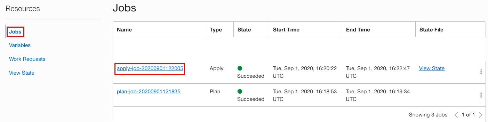

      Under "Resources" on the left you can navigate to "Outputs" where you will find the variables again.
      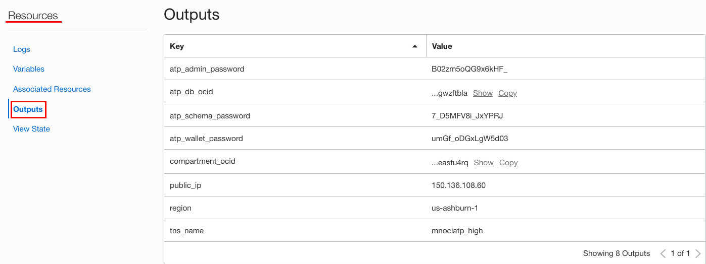

You may now *proceed to the next lab*.

## Learn More

* [Oracle Cloud Resource Manager](https://docs.cloud.oracle.com/en-us/iaas/Content/ResourceManager/Concepts/resourcemanager.htm)
* [Oracle Cloud Autonomous Database](https://docs.cloud.oracle.com/en-us/iaas/Content/Database/Concepts/adboverview.htm)

## Acknowledgements
- **Owners** - Graeme Rocher, Architect, Oracle Labs - Databases and Optimization
- **Contributors** - Chris Bensen, Todd Sharp, Eric Sedlar
- **Last Updated By** - Kay Malcolm, DB Product Management, August 2020

## Need Help?
Please submit feedback or ask for help using our [LiveLabs Support Forum](https://community.oracle.com/tech/developers/categories/building-java-cloud-applications-with-micronaut-and-oci). Please click the **Log In** button and login using your Oracle Account. Click the **Ask A Question** button to the left to start a *New Discussion* or *Ask a Question*.  Please include your workshop name and lab name.  You can also include screenshots and attach files.  Engage directly with the author of the workshop.

If you do not have an Oracle Account, click [here](https://profile.oracle.com/myprofile/account/create-account.jspx) to create one.
