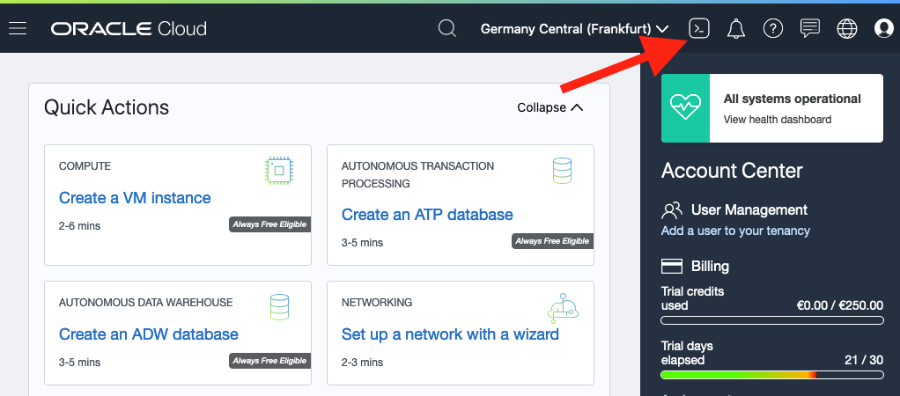

# Setup for Local Development

## Introduction
In this lab you are going to get setup to develop a Micronaut application locally that communicates with an Autonomous Database instance.

Estimated Lab Time: 10 minutes

### Objectives

In this lab you will:
* Create the Necessary Database schema
* Download the Wallet for Autonomous Database access

### Prerequisites
- An Oracle Cloud account, Free Trial, LiveLabs or a Paid account

## **STEP 1**: Create DB Schema

1. Click on the Cloud Shell button to start a Cloud Shell instance:

   

2. From Cloud Shell, download the script and run it:

    ```
    <copy>
    wget -O setup.sh https://objectstorage.us-phoenix-1.oraclecloud.com/n/toddrsharp/b/micronaut-lab-assets/o/setup.sh
    chmod +x setup.sh
    ./setup.sh
    </copy>
    ```
3. Enter the value of `script_input` that you copied from the Terraform output in the previous lab when prompted.


The script will produce several snippets of output to be used to build, run and deploy.

## **STEP 2**: Download and Configure Wallet Locally

The Oracle Autonomous Database uses an extra level of security in the form of a wallet containing access keys for your new Database.

To connect locally you need to download and configure the ATP Wallet locally.

1. In the OCI Console, click on the burger menu and select 'Autonomous Transaction Processing' under 'Oracle Database'.

    

2. Make sure you are in the `mn-oci-hol` compartment:

   

**Note: if you do not see the `mn-oci-hol` compartment in the dropdown, please refresh the page and try again.**

3. Find the newly created instance and click on it.

    

4. In the instance details, click on 'DB Connection'.

    

5. In the 'Database Connection' dialog, select 'Instance Wallet' and click 'Download Wallet'.

    

6. Enter (and confirm) the `atp_wallet_password` from the Terraform output you obtained in the previous lab and click 'Download'.

    

7. After the wallet zip has been downloaded, unzip it and move it to `/tmp/wallet`. You can do this with a single command in a terminal window on a Unix system, however the file can be extracted to a location of your choosing:

    ```
    <copy>
    unzip /path/to/Wallet_mnociatp.zip -d /tmp/wallet
    </copy>
    ```

8. Once downloaded your wallet directory should contain the following files:

   


You may now *proceed to the next lab*.

## Acknowledgements
- **Owners** - Graeme Rocher, Architect, Oracle Labs - Databases and Optimization
- **Contributors** - Chris Bensen, Todd Sharp, Eric Sedlar
- **Last Updated By** - Kay Malcolm, DB Product Management, August 2020

## Need Help?
Please submit feedback or ask for help using our [LiveLabs Support Forum](https://community.oracle.com/tech/developers/categories/building-java-cloud-applications-with-micronaut-and-oci). Please click the **Log In** button and login using your Oracle Account. Click the **Ask A Question** button to the left to start a *New Discussion* or *Ask a Question*.  Please include your workshop name and lab name.  You can also include screenshots and attach files.  Engage directly with the author of the workshop.

If you do not have an Oracle Account, click [here](https://profile.oracle.com/myprofile/account/create-account.jspx) to create one.
